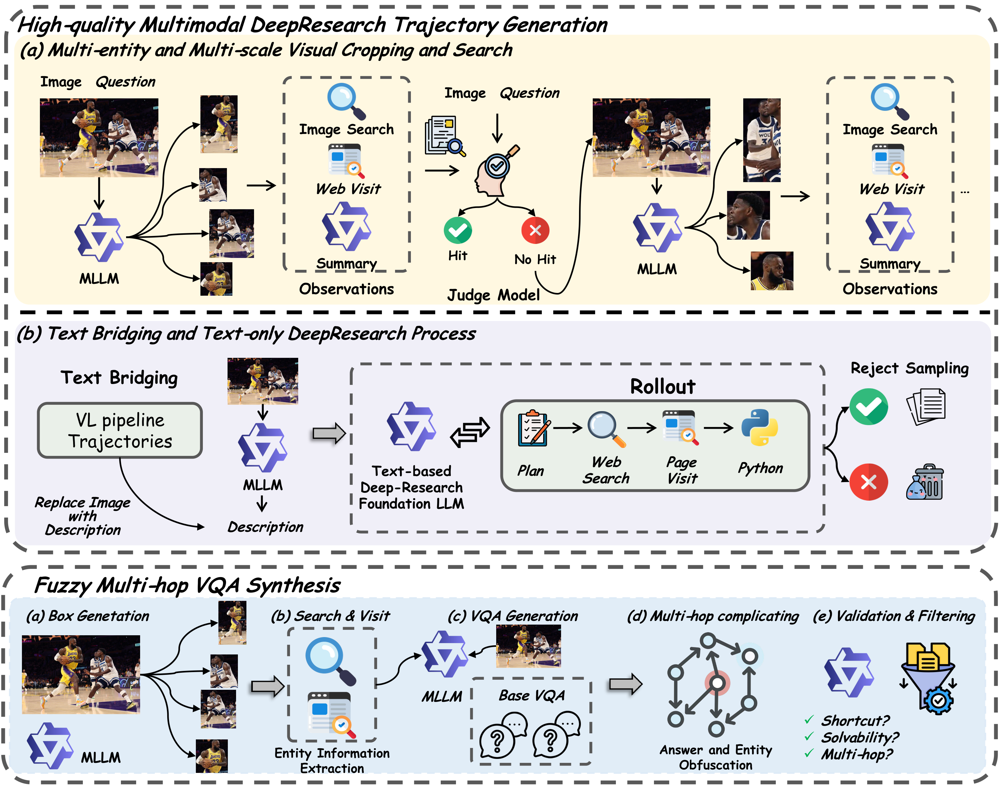
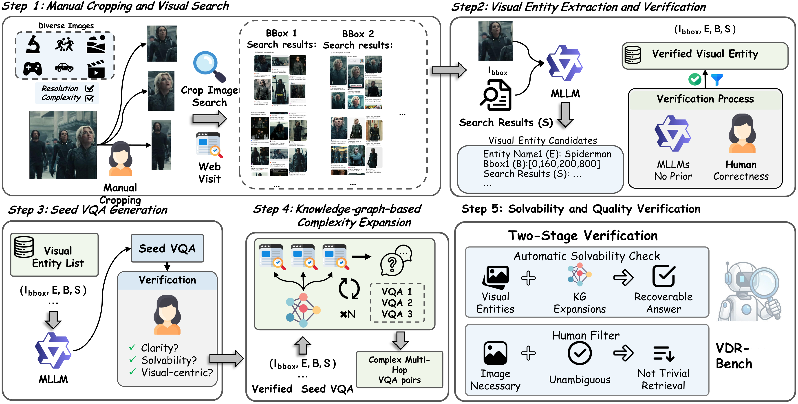

# Vision-DeepResearch & Vision-DeepResearch Benchmark (VDR-Bench)

The official repo for "Vision-DeepResearch: Incentivizing DeepResearch Capability in Multimodal Large Language Models" and "Vision-DeepResearch Benchmark: Rethinking Visual and Textual Search for Multimodal Large Language Models".

       🤗 <a href="https://github.com/Osilly/Vision-DeepResearch">Cold-start Dataset (demo)</a>&nbsp&nbsp | &nbsp&nbsp🤗 <a href="https://github.com/Osilly/Vision-DeepResearch">RL Dataset (demo)</a>&nbsp&nbsp | &nbsp&nbsp🤗 <a href="https://github.com/Osilly/Vision-DeepResearch">VDR-Bench (full)</a>&nbsp&nbsp | &nbsp&nbsp🤗 <a href="https://github.com/Osilly/Vision-DeepResearch">VDR-Bench (testmini)</a>&nbsp&nbsp

       🤗 <a href="https://github.com/Osilly/Vision-DeepResearch">Vision-DeepResearch-30B-A3B</a>&nbsp&nbsp | &nbsp&nbsp🤗 <a href="https://github.com/Osilly/Vision-DeepResearch">Vision-DeepResearch-8B</a>&nbsp&nbsp 

  📑<a href="https://github.com/Osilly/Vision-DeepResearch/blob/main/papers/Vision-DeepResearch.pdf">Vision-DeepResearch Paper</a>&nbsp&nbsp | &nbsp&nbsp📑 <a href="https://github.com/Osilly/Vision-DeepResearch/blob/main/papers/VDR-Bench.pdf">VDR-Bench Paper</a>&nbsp&nbsp

The datasets, code and weights will be released, stay tuned!

## Demo

## Performance

| Model                                  | VDR          | FVQA         | MMSearch+    | MMSearch     | LiveVQA      | BC-VL        | Avg.         |
| -------------------------------------- | ------------ | ------------ | ------------ | ------------ | ------------ | ------------ | ------------ |
| **Direct Answer**                      |              |              |              |              |              |              |              |
| GPT-5                                  | 9.8          | 57.3         | 19.1         | 33.3         | 57.5         | 47.2         | 37.4         |
| Gemini-2.5 Pro                         | 8.0          | 60.7         | 14.5         | 39.8         | 60.3         | 43.1         | 37.7         |
| Gemini-2.5 Flash                       | 6.2          | 47.7         | 8.1          | 30.4         | 51.0         | 37.1         | 30.1         |
| Claude-4-Sonnet                        | 2.0          | 35.3         | 4.0          | 18.7         | 38.5         | 29.3         | 21.3         |
| Claude-3.7-Sonnet                      | 4.6          | 36.7         | 4.0          | 21.1         | 38.0         | 32.3         | 22.8         |
| Qwen3-VL-8B-Instruct                   | 2.8          | 28.0         | 3.2          | 15.2         | 41.0         | 25.1         | 19.2         |
| Qwen3-VL-8B-Thinking                   | 5.6          | 24.0         | 2.7          | 15.8         | 43.3         | 25.1         | 19.4         |
| Qwen3-VL-30B-A3B-Instruct              | 3.8          | 34.7         | 3.2          | 18.7         | 42.7         | 29.6         | 22.1         |
| Qwen3-VL-30B-A3B-Thinking              | 4.4          | 32.7         | 4.5          | 19.3         | 49.0         | 34.6         | 24.1         |
| **RAG Workflow**                       |              |              |              |              |              |              |              |
| Gemini-2.5-flash                       | --           | --           | --           | 43.9         | 41.3         | 12.1         | --           |
| Claude-3.7-Sonnet                      | --           | --           | --           | 32.7         | 30.3         | 10.0         | --           |
| Qwen-2.5-VL-72B                        | --           | --           | --           | 29.2         | 35.7         | 10.2         | --           |
| **Agent Workflow**                     |              |              |              |              |              |              |              |
| GPT-5                                  | 20.4         | 69.0         | 17.2         | 63.7         | 73.3         | 46.1         | 48.3         |
| Gemini-2.5 Pro                         | 18.8         | 68.3         | 22.2         | 69.0         | 76.0         | 49.9         | 50.7         |
| Gemini-2.5 Flash                       | 16.3         | 68.0         | 19.9         | 64.0         | 73.0         | 44.6         | 47.6         |
| Claude-4-Sonnet                        | 13.6         | 69.0         | 23.1         | 67.2         | 69.7         | 48.6         | 48.5         |
| Claude-3.7-Sonnet                      | 27.2         | 67.3         | 17.2         | 63.7         | 72.0         | 50.4         | 49.6         |
| Qwen3-VL-8B-Thinking                   | 17.6         | 51.3         | 12.2         | 45.6         | 56.3         | 37.1         | 36.7         |
| Qwen3-VL-30B-A3B-Thinking              | 23.2         | 63.0         | 13.6         | 53.2         | 62.0         | 44.1         | 43.2         |
| **Multimodal DeepResearch MLLM**       |              |              |              |              |              |              |              |
| MMSearch-R1-7B                         | --           | 58.4         | --           | 53.8         | 48.4         | --           | --           |
| Webwatcher-7B                          | --           | --           | --           | 49.1         | 51.2         | 20.3         | --           |
| Webwatcher-32B                         | --           | --           | --           | 55.3         | 58.7         | 26.7         | --           |
| **Ours**                               |              |              |              |              |              |              |              |
| Qwen3-VL-8B-Instruct (Agentic)         | 17.0         | 58.7         | 11.3         | 52.0         | 63.0         | 38.6         | 40.1         |
| **Vision-DeepResearch-8B (Ours)**      | 29.2 (+12.2) | 64.7 (+6.0)  | 20.4 (+9.1)  | 69.6 (+17.6) | 76.7 (+13.7) | 42.6 (+4.0)  | 50.5 (+10.4) |
| Qwen3-VL-30B-A3B-Instruct (Agentic)    | 20.2         | 57.7         | 10.0         | 55.0         | 60.0         | 42.6         | 40.9         |
| **Vision-DeepResearch-30B-A3B (Ours)** | 37.8 (+17.6) | 74.2 (+16.5) | 28.5 (+18.5) | 69.6 (+14.6) | 77.6 (+17.6) | 53.7 (+11.1) | 56.9 (+16.0) |

## Teaser

### Vision-DeepResearch

### VDR-Bench

## Data Pipeline

### Vision-DeepResearch

### VDR-Bench

## Train

### SFT

### RL

## Eval

### Verl Rollout Engine

### Openai Eollout Engine

