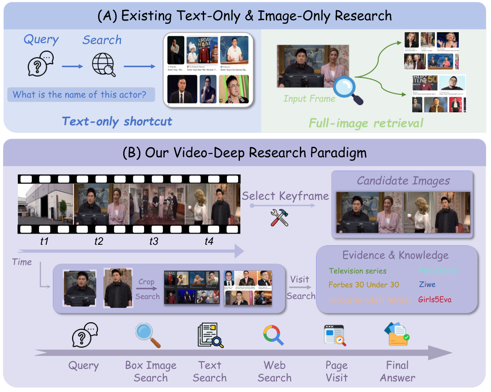
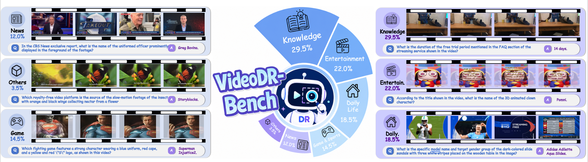
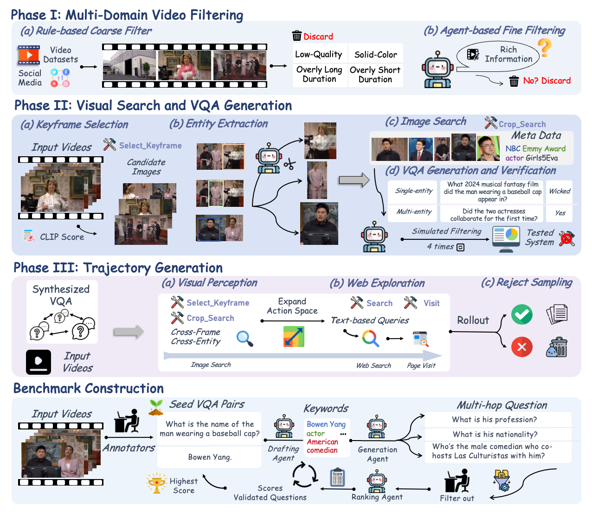

<p align="center">
  <h1 align="center">Video-DeepResearch</h1>
  <p align="center"><em>Towards the Next-Generation Multimodal Deepresearch Agent</em></p>
</p>

<p align="center">
    📑 <a href="https://arxiv.org/abs/2608.03979">Paper</a>
    &nbsp;·&nbsp;
    🌐 <a href="https://osilly.github.io/Vision-DeepResearch/">Project Page</a>
    &nbsp;·&nbsp;
    🤗 <a href="https://huggingface.co/Osilly">Models & Data</a>
    &nbsp;·&nbsp;
    🌐 <a href="README.md">English</a> | <b>中文</b>
</p>

## 📢 最新动态

- **[2026-08-05]** 🎉 **Video-DeepResearch** 论文正式发布（[arXiv:2608.03979](https://arxiv.org/abs/2608.03979)）。
- **[即将发布]** 🚀 **VideoDR-Bench500** —— 扩展版评测集，**500 条实例**，覆盖更难、更长时程、更多样的多跳任务，进一步推动 agent 在时间 grounding、跨帧实体追踪、多源知识合成上的能力边界。敬请关注！

---

<p align="center">
  
</p>

Video-DeepResearch (Video-DR) 把 multimodal deep-research agent 从静态图片延伸到**连续视频流**，需要密集的**时空 grounding** 与开放 web 探索同时进行。

在初步实验里我们观察到当前模型的两个瓶颈：**(1) modality bias**——agent 倾向于绕过视觉工具直接走文本搜索；**(2) parametric knowledge leakage**——模型依赖内置记忆而非真正的工具驱动执行。

针对上述问题，Video-DR 提出：
- 一条 **decoupled perception-exploration** 数据流水线：**stage-wise tool unlocking** 强制 agent 在触碰 web 之前先完成跨帧视觉 grounding。
- 一套 **two-stage 训练配方**：SFT (7K trajectories + 7K text-only QA) → **GRPO**（2K moderate-difficulty，Pass@4∈(0,1)，负 advantage 20% down-sample）。
- **VideoDR-Bench**：200 条 human-AI 协作标注的 multi-hop VQA，每题都强制需要**视觉搜索 + 外部知识推理**。扩展版 **VideoDR-Bench500** 包含更多有挑战性的任务，即将发布。

> **Video-DeepResearch-35B-A3B: 64.0% avg accuracy** — 超过 Claude-4.5-Sonnet (59.0%) 5 分，同时显著优于 GPT-5 (52.5%) 和 Gemini 2.5 Pro (57.5%)。30B-A3B 变体 59.3%，与 Claude-4.5-Sonnet 打平。

---

## Repository Layout

```
Video-DeepResearch/
├── preprocess/   # 1. 数据预处理：视频 → 关键帧
├── eval/         # 2. 评测：sglang / vllm / maas 三种部署
├── sft/          # 3. 有监督微调：ms-swift + megatron
└── rl/           # 4. 强化学习：slime + megatron + GRPO
```

四个子模块对应论文里训练与评测的完整链路（图 1 pipeline）。所有子目录都可以独立使用，不需要额外的 slime / ms-swift 全局安装。

---

## 1. 数据预处理 (preprocess/)

从视频抽取视觉上有区分度的关键帧，输出到 `{output_dir}/{video_id}/frame_XXXX.XX.png`。CLIP 优先（`--clip-model` 指定路径）用余弦相似度过滤冗余帧；CLIP 不可用则退化到 pixel-diff（更快但精度低）。支持多 GPU 并行。

```bash
python3 preprocess/extract_keyframes.py \
    --video-dir  /path/to/videos \
    --output-dir /path/to/frames \
    --clip-model /path/to/clip-vit-large-patch14-336 \
    --max-frames 20 \
    --interval   1.0 \
    --threshold  0.80 \
    --num-gpus   8
```

**核心参数**：`--interval`（采样步长，秒）· `--threshold`（相似度阈值，越高过滤越激进）· `--max-frames`（每视频保留帧数上限）· `--max-size`（最长边尺寸）。

抽出的帧直接被下游 `eval/` 和 RL rollout 消费，是所有 Video-DR 工具流的起点（论文 §3 中 `Select_Keyframe` + `Crop_Search` 的输入源）。

---

## 2. 评测 (eval/)

三种后端入口，对应三种推理部署方式。都会读取 `eval/config.yaml`（工具 API key、rollout 工作目录、reward server URL）和 `eval/prompts/*.txt`（tool / direct 模式的 system prompt）。

- **`run_eval_sglang.sh`** — 本地 sglang 部署，最简单
- **`run_eval_vllm.sh`** — vLLM 部署，同时兼容 `BACKEND=openai|claude` 代理闭源模型
- **`run_eval_maas.sh`** — MaaS 网关（OpenAI 兼容），无需本地 checkpoint

`eval/vdr_core/` 是内嵌的 slime 依赖切片（~17 个文件，无需另装 slime）。核心：`rollout.py` 里本地的 `GenerateState` shim（只暴露 tokenizer/processor）、`env.py` 里的 Gym-style 多轮 tool 交互环境、`slime_utils/` 里 slime 原生 utils 的最小切片。

**前置**：keyframes 已抽好，并需要**三个 server**同时在跑：

1. **Inference server** —— 被测 VLM（SGLang / vLLM），作为 `inference_url` 传给启动脚本。
2. **Judge server** —— OpenAI 兼容的 vLLM endpoint（论文用 Qwen3-VL-30B-A3B-Instruct），给每条 rollout 的 `<answer>` 打分。
3. **Extract server** *（必需）* —— 被 `Visit` 工具用来把抓回来的网页正文压缩成结构化摘要。**没有它 `Visit` 只能返回原始 HTML，agentic 精度显著下降**。

Extract server 支持**两种部署 backend**，通过 `eval/config.yaml` 里的 `extract_backend` 切换：

**方式 A —— vLLM（OpenAI 兼容）**：可以和 judge 复用同一个实例。

```bash
CUDA_VISIBLE_DEVICES=0,1,2,3,4,5,6,7 vllm serve \
    Qwen/Qwen3-VL-30B-A3B-Instruct \
    --host 0.0.0.0 --port 8001 \
    --tensor-parallel-size 8 \
    --gpu-memory-utilization 0.8 \
    --served-model-name "Qwen3-VL-30B-A3B-Instruct" \
    --max_model_len 160000 \
    --mm-processor-cache-gb 0 \
    --no-enable-prefix-caching
```

```yaml
# eval/config.yaml
extract_model:   Qwen3-VL-30B-A3B-Instruct
extract_backend: vllm       # POST /v1/chat/completions
extract_url:     http://<vllm-host>:8001/v1
```

**方式 B —— SGLang 原生 `/generate`**：独立 SGLang server。

```bash
python3 -m sglang.launch_server \
    --model-path Qwen/Qwen3-VL-30B-A3B-Instruct \
    --host 0.0.0.0 --port 13141 \
    --tp 8 --mem-fraction-static 0.8
```

```yaml
# eval/config.yaml
extract_model:   Qwen3-VL-30B-A3B-Instruct
extract_backend: sglang_generate   # POST /generate
extract_url:     http://<sglang-host>:13141/generate
```

`extract_*` 三个 key 会被 `env.build_env → _sync_tool_config_to_env` 自动桥接到 `EXTRACT_MODEL` / `EXTRACT_BACKEND` / `EXTRACT_URL` 环境变量，runtime 由 `visit_tool.py`（走 `vdr_core/tools/shared.py` 里的 `call_extract_model_async`）读取。`eval/deploy/` 下也有辅助脚本用来起 inference / reward 服务。

```bash
# sglang（开源本地部署）
bash eval/run_eval_sglang.sh http://SGLANG_HOST:13141 http://JUDGE_HOST:8001 both Video-DR-35B-A3B

# vllm（也可 openai/claude 代理，BACKEND=... 切换）
bash eval/run_eval_vllm.sh   http://VLLM_HOST:8000/v1 http://JUDGE_HOST:8001 both Video-DR-35B-A3B

# maas（闭源模型，OpenAI 兼容网关）
BACKEND=openai bash eval/run_eval_maas.sh "<API_KEY>" "https://<maas-host>/v1" http://JUDGE_HOST:8001 both qwen3.5-35b-a3b
```

**输出**：`eval/output/results/{model_name}/{mode}/`（mode ∈ {tool, direct, both}）。

**数据 / 输出路径可通过环境变量覆盖**：`CSV`、`FRAMES_DIR`、`OUTPUT_DIR`、`CONFIG`、`HF_CHECKPOINT`。

**评测协议**（论文 §5）：`Direct` 只让模型看 keyframes 直接回答（tool-free）；`Agentic` 开放全套工具 (`Select_Keyframe` / `Crop_Search` / `Search` / `Visit`) 多轮执行。判分走独立的 vLLM judge server。

### Main Results（论文表 1，Agentic 设置）

| Model | Video-DR | VideoDR-Bench Overall | **Avg** |
|:---|:---:|:---:|:---:|
| **Video-DeepResearch-35B-A3B** (Ours) | **72.4** | **71.2** | **64.0** |
| **Video-DeepResearch-30B-A3B** (Ours) | 68.0 | 67.5 | 59.3 |
| Claude-4.5-Sonnet | 66.2 | 69.5 | 59.0 |
| Gemini 2.5 Pro | 62.0 | 53.0 | 57.5 |
| GPT-5 | — | — | 52.5 |

<p align="center">
  
  <br><em>VideoDR-Bench 覆盖六大视频领域 —— Knowledge、Entertainment、Daily Life、Game & Sports、News、Others —— 每一条实例都强制需要视觉 grounding + 多跳知识推理。</em>
</p>

---

## 3. 有监督微调 (sft/)

基于 ms-swift 的 `megatron sft`，Qwen3-VL-30B-A3B-Instruct（MoE，256 experts / top-8）作为基座。集群：4 节点 × 8 × 80 GiB H800（TP=4, EP=8, CP=2, PP=1，micro=1, global=64）。

**训练数据**（论文 §4.3）：7K decoupled perception-exploration 轨迹 + 7K VDR text-only QA，通过 mixed training 同时强化视觉工具使用与文本 deep research 能力。

<p align="center">
  
  <br><em>VideoHunter 三阶段流水线：(I) 视频过滤；(II) 带 parametric-leakage 过滤的 VQA 合成；(III) decoupled perception-exploration 轨迹构造。</em>
</p>

```bash
# 单节点快速跑通
bash sft/run_video_dr_sft.sh

# 多节点（每台执行，NODE_RANK 由外部调度器给）
WORLD_SIZE=4 RANK=$NODE_RANK bash sft/run_video_dr_sft.sh
```

**环境变量覆盖**：`MODEL_PATH`、`DATASET_PATH`（空格分隔多路径）、`SAVE_PATH`、`WANDB_KEY`、`NPROC_PER_NODE`。

**数据格式**（每行 JSONL）：`messages`（多轮 system/user/assistant，含 `<image>` 占位符）+ `images`（图片路径列表，与占位符顺序对齐）。

`sft/ms-swift/` 是拷贝的 ms-swift 源码（排除 checkpoints / asset / docs / tests），需先按 `sft/ms-swift/requirements.txt` 装依赖。

---

## 4. 强化学习 (rl/)

基于 slime + megatron backend + sglang rollout 的 GRPO 训练。论文 §4.3 关键超参：

- **奖励**：sparse binary，`r=1` 表示 judge (Qwen3-VL-30B-A3B-Instruct) 判对，否则 `r=0`
- **数据**：2K moderate-difficulty，Pass@4 严格 ∈ (0, 1)
- **负 advantage 下采样**：格式违反 / 重复循环轨迹的负 gradient 只按 20% 概率生效 (`--negative-advantage-keep-prob 0.2`)
- **稳定项**：`KL=0`, `ε_clip=0.2/0.28`，`--rollout-max-response-len 64000`, `--global-batch-size 512`
- **模型并行**：TP=1, PP=2, EP=8, DP=8

**前置**：
- Ray 集群已起（`SLIME_SCRIPT_EXTERNAL_RAY=1` + `RAY_JOB_ADDR`；或设 `0` 让脚本本地起 head）
- **Judge server**（vLLM，OpenAI 兼容）可达 `JUDGE_IP:JUDGE_PORT/v1/models`
- **Extract server** *（必需）* —— 和 eval 阶段一样：rollout 期间 `visit_tool` 也会调用它给网页正文做摘要。按 eval 章节里的方式部署（SGLang `/generate` 或 vLLM `/v1/chat/completions`），在 `rl/examples/vision_deepresearch/config.yaml` 里把 `extract_backend` / `extract_url` / `extract_model` 指向它。实操上 judge 的 vLLM 实例可以直接兼任 extract。

```bash
export SLIME_SCRIPT_EXTERNAL_RAY=1
export SLIME_SCRIPT_NUM_NODES=2
export SLIME_SCRIPT_GPUS_PER_NODE=8
export SLIME_SCRIPT_RAY_JOB_ADDR="http://127.0.0.1:8265"
export SLIME_SCRIPT_JUDGE_IP="<judge-host>"
export SLIME_SCRIPT_JUDGE_PORT=8001
export SLIME_SCRIPT_TRAIN_DATA="/path/to/rollout.jsonl"

bash rl/run_grpo.sh
```

`rl/slime/` 是精简的 slime 框架（~1 MB，只含 utils / rollout / backends / ray），`rl/scripts/models/` 含各模型的 megatron 配置脚本，`rl/train.py` 是 slime 入口，`rl/examples/vision_deepresearch/` 是 vdr 侧的 env / rollout / preprocess 代码。

---

## Known Issues

代码整理过程中做了一些结构调整（拆分子目录、改写 import、抽 slime shim），与最初上游版本存在差别。已知可能遇到的小问题：

- **eval/vdr_core/rollout.py 的 `GenerateState` 是本地 shim**：只提供 tokenizer/processor 且是进程级单例（不按 hf_checkpoint 区分）。单机 eval 场景够用；若要在同一进程加载多个 checkpoint 或接入完整 slime 训练，需换回原实现。
- **eval/vdr_core/env.py 的 `_judge` 走 slime.rollout.rm_hub 软依赖**（try/except ImportError）：装了完整 slime 就返回真实分数、没装就返回 0.0。eval 侧的评分实际走 `run_eval.py` 里的 `DeepResearchReward`，不受影响；RL 训练则需要真正的 slime。
- **eval/vdr_core/env.py 的 system prompt 路径**从上游的 `Path(__file__).parent/"eval"/eval_system_prompt.txt` 改成了 `Path(__file__).parent.parent/"prompts"/eval_system_prompt.txt`（对齐新目录结构）。
- **eval/config.yaml 里显式设置了 `rollout_interaction_env_path: vdr_core.env`**，让 rollout.py 找到本地 env 模块。
- **eval/config.yaml 中路径已改为相对 `./output/...`**，从别的目录起脚本需 `cd eval/` 或改回绝对路径。
- **eval 需要的环境变量**（`ZHIPU_API_KEY` / `OSS_ACCESS_KEY_ID` / `OSS_ACCESS_KEY_SECRET` / `IMAGE_CROP_CACHE` / `EXTRACT_URL` 等）由 `env.build_env → _sync_tool_config_to_env` 自动从 config.yaml 桥接到 os.environ，无需手动 export（前提是走 config.yaml）。
- **所有 config.yaml 里的 API key / OSS 秘钥都是占位符**（`<YOUR_ZHIPU_API_KEY>` 之类），需自行替换成有效值。
- **sft/ms-swift/** 只是源码，没有 checkpoints，需自行提供 base model 路径。装依赖 `pip install -r sft/ms-swift/requirements.txt`。
- **rl/slime/** 是 slime 最小子集（不是完整 slime-2.4），若要 hack 一些 slime 内部逻辑可能找不到对应模块，需从上游补齐。
- **rl/run_grpo.sh 的默认 `TRAIN_DATA_RAW` 是占位路径 `/path/to/rollout.jsonl`**，必须通过 `SLIME_SCRIPT_TRAIN_DATA` 覆盖。
- **preprocess 的 `--clip-model` 默认为空字符串**，未提供时会 fallback 到 pixel-diff（更快但精度低）。

如果复现过程中遇到问题，欢迎联系 **fazii@mail.ustc.edu.cn**。

---

## Citation

```bibtex
@article{huang2026videodr,
  title   = {Video-DeepResearch: Towards the Next-Generation Multimodal Deepresearch Agent},
  author  = {Huang, Wenxuan and Zeng, Yu and Fang, Zhen and others},
  journal = {arXiv preprint arXiv:2608.03979},
  year    = {2026}
}
```
